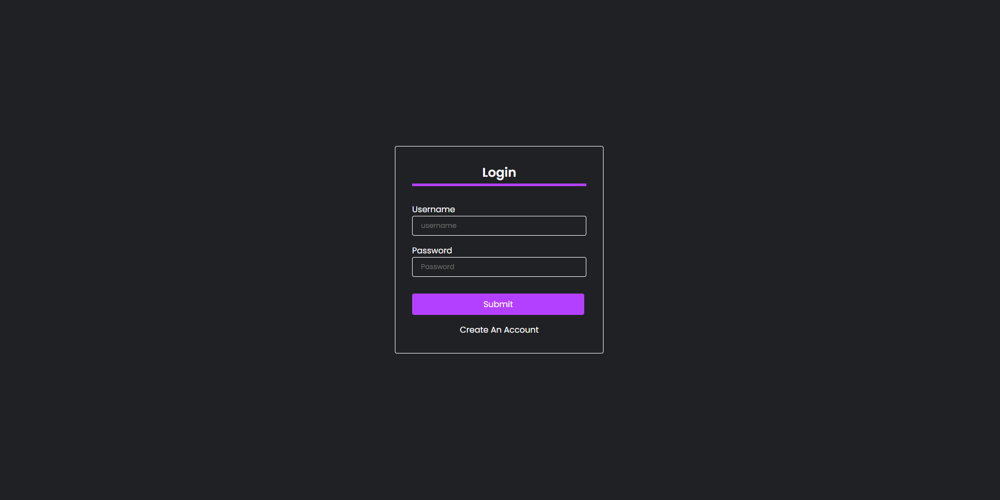
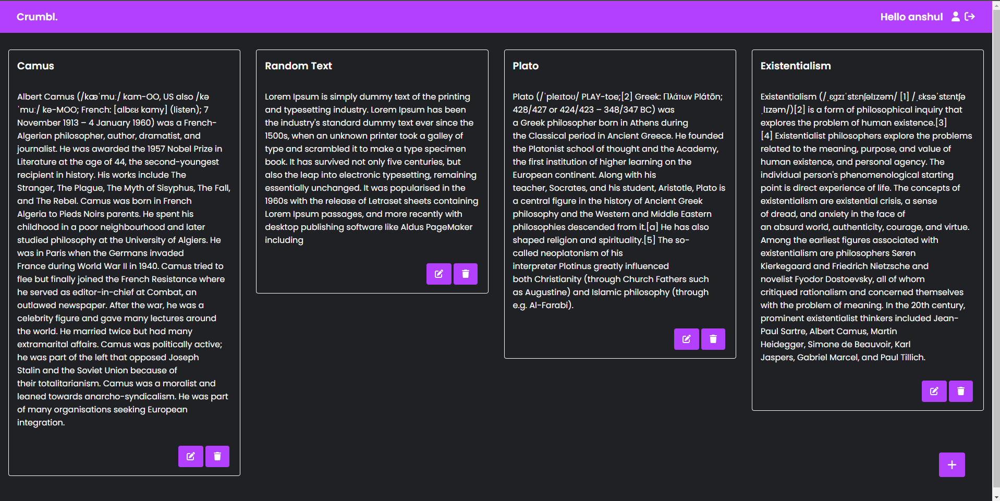
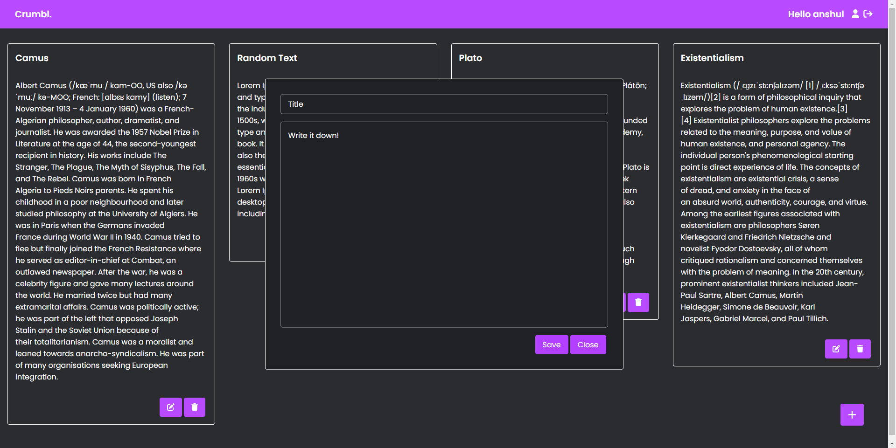

# Crumbl.
Crumbl. is a minimalistic full stack notes app built using React and Django. 

### Screenshots

### Things I learnt

- About useContext Hooks
- How RESTful API's work
- Integrating a React project with Django using Django REST Framework(DRF)
- JavaScript Web Token(JWT) Authentication 
